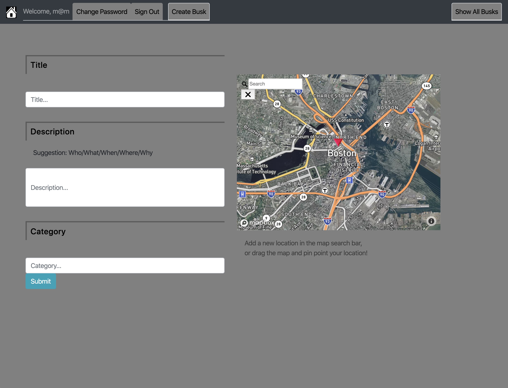

# Welcome to Busk

This application was developed to allow users to create events that could be
easily accessed. Users would be anyone who would want to street perform and
let others know about their upcoming performance. The application uses a
mongo database to store their busks open to anyone but only manageable by the
specific user. As for the front end, React was used with heavy implementation on
using components.

## Resources

- [Back end repo](https://github.com/Moutwei/busk-express-api)
- [Deployed application (GitHub pages)](https://Moutwei.github.io/busk-react-client)
- [Deployed back end (Heroku)](https://guarded-wave-56773.herokuapp.com/)

## Technologies Used

- AXIOS
- Atom
- Bootstrap
- CSS/SASS
- CURL
- Express
- Git/GitHub
- Heroku
- HTML
- Javascript
- MongoDB
- Mongoose
- Node.js
- NPM
- Mapbox
- Geocoder
- React

## Unsolved Problems/ Future Ambitions

- map marker moves out of place when zoomed in and out
- need to add time and date properties to busks resource
- add more styling for better appearance

## Process & Problem Solving Strategies

Heavy planning was put into this project. At first I wanted to create an
app related to superheroes, but then last minute changed to wanting to create
something more useful. Wireframes and ERD's were carefully drawn afterwards in
order to have a solid plan before going into the code. Below are references to
these drawings and plannings. When solving problems and coding, I would go
with a strategy of starting simple adn adding more only when I know whats going
on. In other words, I try not to code blindly and its been working out pretty
well.

## Wiredrames, User Stories, and ERD Links...

## Application in Action

## Installation and Setup Instructions
1. Download react template
2. Install NPM dependencies
3. Run 'git init'
4. Create a development branch
5. Code and Commit away
